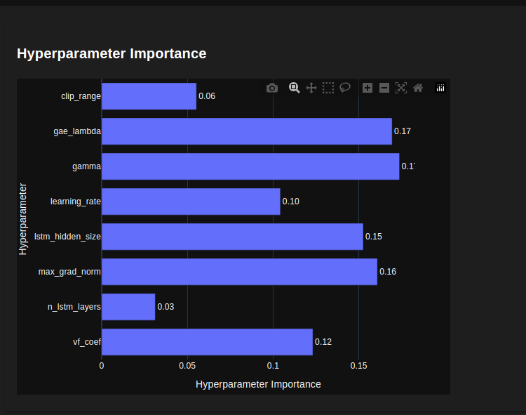

# TRADING SYSTEM WITH REINFORCEMENT LEARNING

## Project Description
The proposed project aims to develop a trading system based on Reinforcement Learning. The trading system will make daily decisions to buy or sell, depending on the price movements and technical indicators of financial assets, in order to maximize profit over periods of at least 30 days.

## Implementation Methods
To implement the trading system, I trained agents using Deep Reinforcement Learning. Since the states are numerous (prices and indicators are real, fluctuating numbers, resulting in an extremely high number of states that cannot be stored in a tabular format), they cannot be stored in a matrix format. Thus, our project presents Function Approximation algorithms. The financial world is influenced by many external factors and is also very dynamic and noisy. Our intuition is that a stochastic policy will perform better for the presented problem. Not every given action is the best considering the information available to the system, so this type of policy better manages the trade-off between exploration and exploitation. Therefore, in light of a more drastic change in the market, the system can adapt more effectively. Our intuition proves to be correct and will be demonstrated in the results section.

## Data Used
For training, we used a dataset from Google, collected by the author of the environment we used, which contains 2,335 examples from the period 2009-2018. The data format includes the date of the recorded price, opening and closing prices, closing price after dividends, the lowest and highest price of the day, and the volume of shares traded that day. For testing, we obtained several datasets from Yahoo Finance, from 2015 (for companies listed on the stock exchange up to and including 2015) to 2023 (01.01.2015-31.12.2023), following the same format as the training data. The assets for which we obtained test data include: Tesla, Ethereum, Bitcoin, Google, Amazon, Apple, Microsoft, Netflix, Spotify, PayPal, Nike, Disney, AMD, Intel, Nvidia, IBM, Alibaba, Uber, Airbnb.

## Environment Description
The trading environment is defined using a customized version of the Anytrading Gym trading environment, specifically the stockenv environment from this framework. We maintained the profit calculation (calculated as a percentage), positions (long when the agent buys low to sell high, and short when selling high to buy low), actions (buying and selling), window size (the number of days in an observation/state), and a selling commission of 1% of the sale price and a buying commission of 0.5% as requested by the trading platform. Our modifications are as follows:

### Defining the Environment State
The state where the agent can be is represented by: price (closing price, standard in this context), volume of shares traded, opening price, closing price, lowest and highest price, Triple Exponential Moving Average (TEMA 30, indicating the trend direction over 30 days, with greater emphasis on recent days. Making buying and selling decisions daily, we decided to place greater emphasis on the last trading days), Kaufman Efficiency Indicator (ER, an indicator for trend confirmation, ranges between -1 and 1, -1 = downtrend, 1 = uptrend, approx. 0 = random), Relative Strength Index (RSI, an indicator for trend confirmation, ranges from 0 to 100, 30-70 = area of interest, 0-30 = oversold, 70-100 = overbought), On-Balance Volume (OBV, an indicator for trend confirmation based on the volume of trades that day), Stochastic Oscillator (STOCH, an indicator for trend confirmation, ranges between 0 and 100, 20-80 = area of interest, 0-20 = oversold, 80-100 = overbought), all expressed at the daily level.

### Calculating Rewards
To calculate rewards, we tried several approaches:
1. The original reward from the environment, calculated only when a long trade is made (when the agent buys to sell at a higher price), defined as the difference between the current price and the price on the last purchase day; [figure 1]
2. The original reward, but instead of the price difference, a reward of +1 is granted if the selling price is higher than the last purchase price, and -1 otherwise; [figure 2]
3. Similar to the reward function in point 2, but a reward of +1 is given if on that day the agent bought at a lower price and previously sold at a higher price than the current purchase price, otherwise -1. Additionally, in both cases, 0.1 is deducted if prices are equal; [figure 3]
4. The reward as in point 3, but following the reward shaping principle, intermediate rewards are granted for faster convergence, especially helpful at the beginning when the agent is not very intelligent, having a trajectory that does not yield very good rewards and when final rewards are quite rare. Thus, if the agent buys, and previously was long (bought) and the next day's price is higher than the current day's price, it receives a reward of +0.5; otherwise, it receives -0.5. If the agent sells, and previously was short (sold) and the current price is higher than the next day's price, it receives a reward of +0.5; otherwise, it receives -0.5; [figure 4]
5. The reward function number 5 is similar to point 4, but in the case of intermediate rewards, the fixed rewards of +0.5 or -0.5 are no longer given; instead, if the agent is long and buys that day, it will receive the difference between the next day's price and the current price, and if the agent is short and sells that day, it will receive the difference between the current price and the next day's price. [figure 5]

#### Evaluating Reward Functions
We tested each reward function using a recurrent Proximal Policy Optimization model (which will be detailed in the agents section), over a total of 20,000 timesteps with default parameters, across 100 episodes, on the training dataset (80% of the dataset was used for training, and 20% for evaluation—approximately 450 days). We obtained the following results, which will be displayed in the graphs below. As observed, the best reward that generates good profits while also correlating profit and reward is from point (5). This is evident both empirically and intuitively, as we applied the concept of reward shaping, and final rewards are normalized. Even though intermediate rewards are not normalized, they are not substantial enough to negatively impact the algorithms, introducing a stochastic component to move past local optima.

*figure 1*

*figure 2*

*figure 3*

*figure 4*

*figure 5*

## Agents
### DQN
For implementing the trading system, I used two algorithms. 
The first algorithm is Deep Q Network, where instead of a classic MLP or a convolutional network, I used a network formed of two layers of Long Short Term Memory (LSTM), with a hidden size of 64, one fully connected layer of hidden size 64, and a dropout of 0.2 for both LSTM and fully connected layers, as the data is sequential and the order in which it is presented is important. I used a gamma of 0.95, epsilon of 0.99, a minimum epsilon of 0.05, epsilon decay of 0.9 / 100,000, and a learning rate of 0.001. The algorithm uses a replay buffer, with a minimum number of states of 50,000 to start training and a maximum memory size of 1,000,000 states. I trained over 400 episodes. The algorithm follows the structure from the lab, with our modification being the introduction of recurrent networks.

### PPO
The second algorithm we applied to the environment is a recurrent variant of the Proximal Policy Optimization (PPO) algorithm, implemented in stable_baselines3 (in its contrib version). 

The presented algorithm is a simplified version of Trust Region Policy Optimization (TRPO). TRPO is itself a more stable adjustment of the Vanilla Policy Gradient algorithm. PPO is a policy-based algorithm (it directly adjusts the policy, not through a value function or action-value function) and is on-policy (as it samples trajectories from its own policy and chooses the optimal action according to this policy). This algorithm assumes a stochastic policy, which is particularly beneficial in our situation. We used the actor-critic variant of the algorithm to combine the advantages of policy-based and value-based methods, bringing benefits such as faster convergence and stability, although complexity increases.

Initially, the algorithm samples trajectories and calculates the advantage for each timestamp based on information available at that moment. In the case of the actor-critic variant, this information represents the difference between the discounted rewards (calculated from the current timestamp onward) and the value function of the current state (calculated by the model's critic network). Being policy gradient-based, the algorithm uses part of the loss function: \( E_t[\log \pi_\theta (a_t|s_t) \cdot A_t] \), where \( \pi_\theta \) is the policy, \( a_t \) is the action, \( s_t \) is the state, and \( A_t \) is the advantage. This function can be interpreted as follows: when the gradient is positive, the probability of taking action \( a_t \) in state \( s_t \) increases, and when it is negative, the probability decreases. The advantage is the difference between what we know and what the critic network predicted would happen. Thus, when the critic network underestimates and the actual reward is higher, the probability increases for choosing action \( t \) when in state \( t \) in the future. Conversely, when the critic network overestimates, the probability of selecting action \( t \) in state \( t \) decreases.

TRPO introduces a stabilization adjustment by updating the policy without deviating significantly from the previous policy. This deviation is represented by \( KL(\pi_{old}, \pi_{new}) \), which must remain below a set constant. PPO modifies the TRPO algorithm by simplifying it, applying a clip to the loss function to prevent it from deviating too far from the previous policy. The loss function is further complemented by a term representing the loss for the critic network (which calculates the value function if the parameters are shared; otherwise, it is adapted separately) and an entropy coefficient to introduce randomness in the policy for exploration. Both the actor and critic networks are optimized in the gradient direction to maximize rewards using gradient ascent optimization algorithms.

As seen in the attached graphs, our intuition proved correct, with the recurrent PPO agent outperforming the recurrent DQN agent. The recurrent PPO agent was fine-tuned using a hyperparameter tuning framework over 20,000 timesteps, achieving a maximum profit of 48% on the training data.

*Figure 20: the Ox axis represents the number of the tuned model, and the Oy axis represents the profit obtained*

*Figure 21: the importance of hyperparameters in relation to performance, obtained through tuning with the Optuna framework.*

## Performance of the System
For testing the agents, we used the datasets described earlier, from which we extracted the last \( n \) days (with \( n = 30, 60, 90, 120, 210, 365, 730 \)), with the note that for the Airbnb dataset, we had only 700 days available, as that was all we had at our disposal. We tested over 50 episodes and averaged the results in the case of PPO (being stochastic) and over a single episode in the case of DQN (being deterministic). The results are shown in the graphs below.

*figure 6 DQN*

*figure 7 PPO*

*figure 8 DQN*

*figure 9 PPO*

*figure 10 DQN*

*figure 11 PPO*

*figure 12 DQN*

*figure 13 PPO*

*figure 14 DQN*

*figure 15 PPO*

*figure 16 DQN*

*figure 17 PPO*

*figure 18 DQN*

*figure 19 PPO*

## Conclusion
The results show that algorithms with recurrent networks and a stochastic policy (Recurrent PPO) perform very well, but the Deep Q-Network also produced satisfactory results. Additionally, the concept of reward shaping greatly contributed to better and faster convergence.

## Libraries Used
- pandas
- numpy
- matplotlib
- stable-baselines3
- tensorflow
- gym

## Future improvements
- Performance improvements
- Add more indicators
- Integrate additional risk measures
- Extend the trading horizon to allow for long-term investments
- Explore the potential of other learning methods such as A3C or TRPO.
